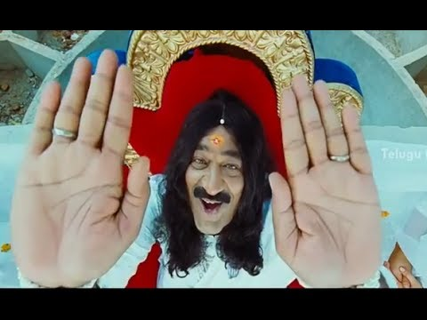

# BEWARE OF SPIRITUAL GURUS OF THIS KIND
* Right Click on the image and select **Open Link in New Tab** from the pop-up menu
* 
* Video content in text with translation
	1. **Swami ji:** One! ... Two! ... Three!
	2. **Disciples and Swamiji:** Dingi Chaka Dingi Chaka Dingi Chaka Dingi Chaka re e e e e e e e.
	3. **Disciple:** Swami! I have a doubt.
	4. **Swami ji:** Go ahead my child!
	5. **Disciple:** What is the meaning of 'Dingi Chaka'
	6. **Swami ji:** That is a good question! Children! Ding means supreme soul (May All Mighty GOD forgive us) and Chaka means your soul. Integrating Supreme soul with your soul is called Dingi Chaka! 'Touch God'. Are you all ready to touch God?
	7. **Disciples:** Yes!
	8. **Disciples and Swamiji:** Dingi Chaka Dingi Chaka Dingi Chaka Dingi Chaka re e e e e e e e.
	9. **Swami ji:** My son Shantaram! My son Balram! My son Ravindra! May you get a life partner soon!
	10. **Politician:** Do not bless me! Say may the whole world achieve peace and prosperity. May all the people attain tranquility!
	11. **Disciples:** Claps!
	12. **Swami ji (in his mind):** I had always believed that I am the biggest fraudster but this guy seems to be ...
	13. **Politician:** A bigger fraudster than you! You have done enough! Let us get back to business!