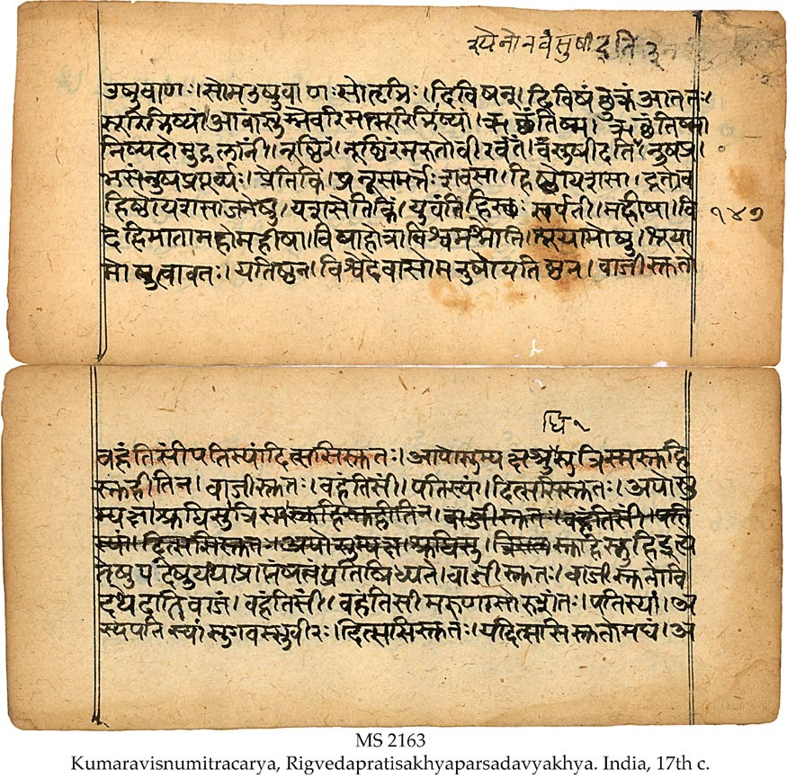

# CONCEPT OF GOD IN HINDUISM

### Common Concept of God in Hinduism:

* Hinduism is commonly perceived as a polytheistic religion. Indeed, most Hindus would attest to this, by professing belief in multiple Gods. While some Hindus believe in the existence of three gods, some believe in thousands of gods, and some others in thirty three crore i.e. 330 million Gods. However, learned Hindus, who are well versed in their scriptures, insist that a Hindu should believe in and worship only one God.

### Concept of God according to Hindu Scriptures

* We can gain a better understanding of the concept of God in Hinduism by analyzing Hindu scriptures.


#### BHAGAVAD GITA
* The most popular amongst all the Hindu scriptures is the Bhagavad Gita.
* Consider the following verse from the Gita:
* > "Those whose intelligence has been stolen by material desires surrender unto demigods and follow the particular rules and regulations of worship according to their own natures." [Bhagavad Gita 7:20]

	* The Gita states that people who are materialistic worship demigods i.e. 'gods' besides the True God.

* Bhagavad Gita Chapter 18 Verse 66 says:
	* > Abandon all varieties of religion and just surrender unto Me. I shall deliver you from all sinful reaction. Do not fear.

	
#### UPANISHADS
* The Upanishads are considered sacred scriptures by the Hindus. The following verses from the Upanishads refer to the Concept of God
	1. > "Ekam evadvitiyam". ("He is One only without a second.") [Chandogya Upanishad 6:2:1]
	2. > "Na casya kascij janita na cadhipah.". ("Of Him there are neither parents nor lord.") [Svetasvatara Upanishad 6:9]
	3. > "Na tasya pratima asti". ("There is no likeness of Him.") [Svetasvatara Upanishad 4:19]
	4. > "eko hi rudro na dvitīyāya tasthe ya imāṃl lokān īśata īśanībhiḥ pratyaṅ janās tiṣṭhati saṃcukocāntakāle saṃsṛjya viśvā bhuvanāni gopāḥ" [Svetasvatara Upanishad 3:2]
	
		* Rudra is truly one; for the knowers of Brahman do not admit the existence of a second, He alone rules all the worlds by His powers. He dwells as the inner Self of every living being. After having created all the worlds, He, their Protector, takes them back into Himself at the end of time.
		
			
	5. > "He has no master in this world, no ruler, nor is there any symbol for Him. He is the cause, the cause of all the causes. He has no father or controller above Him." [Svetasvatara Upanishad 6:9]

* The following verses from the Upanishad allude to the inability of man to imagine God in a particular form:
	* > "Na samdrse tisthati rupam asya, na caksusa pasyati kas canainam." ("His form is not to be seen; no one sees Him with the eye.") [Svetasvatara Upanishad 4:20]
		
		1. [The Principal Upanishad by S. Radhakrishnan page 447 and 448] [Sacred Books of the East, volume 1 ‘The Upanishads part I’ page 93]
		2. [The Principal Upanishad by S. Radhakrishnan page 745] [Sacred Books of the East, volume 15, ‘The Upanishads part II’ page 263.]
		3. [The Principal Upanishad by S. Radhakrishnan page 736 & 737]
[Sacred Books of the East, volume 15, ‘The Upanishads part II’ page no 253]
		4. [The Principal Upanishad by S. Radhakrishnan page 737] [Sacred Books of the East, volume 15, ‘The Upanishads part II’ page no 253]

#### THE VEDAS
* Vedas are considered the most sacred of all the Hindu scriptures. There are four principal Vedas: 
	1. *Rigveda*
	2. *Yajurveda*
	3. *Samveda*
	4. *Atharvaveda*

##### Yajurveda
* The following verses from the Yajurveda echo a similar concept of God:
	1. > "na tasya pratima asti" ("There is no image of Him.") [Yajurveda 32:3]
	2. > "shudhama poapvidham" ("He is bodyless and pure.") [Yajurveda 40:8]
	3. > "Andhatama pravishanti ye asambhuti mupaste" ("They enter darkness, those who worship the natural elements" {Air, Water, Fire, etc.}). "They sink deeper in darkness, those who worship *sambhuti*.") [Yajurveda 40:9]
	
		* Sambhuti means created things, for example table, chair, idol, etc.
		
* The Yajurveda contains the following prayer:
	* > "Lead us to the good path and remove the sin that makes us stray and wander." [Yajurveda 40:16]
		
		1. [Yajurveda by Devi Chand M.A. page 377]
		2. [Yajurveda Samhita by Ralph T. H. Giffith page 538]
		3. [Yajurveda Samhita by Ralph T. H. Giffith page 538]
		4. [Yajurveda Samhita by Ralph T. H. Griffith page 541]


##### Atharvaveda
* The Atharvaveda praises God in Book 20, hymn 58 and verse 3:
	* > "Dev maha osi" ("God is verily great") [Atharvaveda 20:58:3]

	
##### Rigveda
1. The oldest of all the vedas is Rigveda. It is also the one considered most sacred by the Hindus.
2. The Rigveda states in Book 3, hymn 34 and verse 1:
	* > “The Bounteous Giver.”
(Rigved 3:34:1)
3. The Rigveda states in Book 1, hymn 164 and verse 46:  
	* > "Sages (learned Priests) call one God by many names." [Rigveda 1:164:46]
2. The Rigveda gives several different attributes to Almighty God. Many of these are mentioned in
Rigveda Book 2 hymn 1. Among the various attributes of God, one of the beautiful attributes mentioned in the Rigveda Book II hymn 1 verse 3, is *Brahma*. *Brahma* means 'The Creator'. Describing Almighty God in anthropomorphic terms goes against the following verse of Yajurveda:
	* > "Na tasya Pratima asti" ("There is no image of Him.") [Yajurveda 32:3]
3. Another beautiful attribute of God mentioned in the Rigveda Book II hymn 1 verse 3 is *Vishnu*. *Vishnu* means 'The Sustainer'. [Atharveda Samhita vol 2 William Dwight Whitney page 910]. *Vishnu* among Hindus, is that of a God who has four arms, with one of the right arms holding the *Chakra*, i.e. a discus and one of the left arms holding a 'conch shell', or riding a bird or reclining on a snake couch. As mentioned earlier this goes against Svetasvatara Upanishad Chapter 4 verse 19.
	* > "Na tasya pratima asti" ("There is no likeness of Him")
	
4. The following verses from the Rigveda Book 8, hymn 1, verse 1 refer to the Unity and Glory of the Supreme Being:
	* > "Ma cid anyad vi sansata sakhayo ma rishanyata" ("O friends, do not worship anybody but Him, the Divine One. Praise Him alone.") [Rigveda 8:1:1]
	* > "Devasya samituk parishtutih" ("Verily, great is the glory of the Divine Creator.") [Rigveda 5:1:81]

##### Brahma Sutra of Hinduism:
* The Brahma Sutra of Hinduism is:
	* > "Ekam Brahm, dvitiya naste neh na naste kinchan" ("There is only one God, not the second; not at all, not at all, not in the least bit.")


#### CONCLUSION:
* Thus only a dispassionate study of the Hindu scriptures can help one understand the concept of God in Hinduism.
* [Rigveda Samhita vol. 9, pages 2810 and 2811 by Swami Satya Prakash Sarasvati and Satyakam Vidyalankar]
* [Rigveda Samhita vol. 6, pages 1802 and 1803 by Swami Satya Prakash Saraswati and Satyakam Vidyalankar]