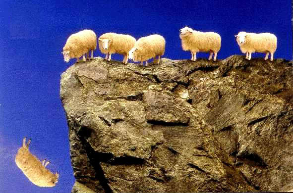

# IS BLINDLY FOLLOWING OTHERS BENEFICIAL?

Let us consider a flock of sheep. One day the sheep decided to climb a hill by forming a queue and walking one behind the other. Let us now assume that each sheep blindly follows the sheep at its front. The sheep climb up the hill and reach the cliff of the hill. Unfortunately, the first sheep slips and falls off the cliff and dies. Since we have assumed that each sheep follows the sheep at its front, the second sheep blindly follows the first sheep and jumps off the cliff and dies. The second sheep is followed by the third sheep, the third followed by fourth etc... until all the sheep jump off the cliff. In the end none of the sheep survived. We can come to the following conclusion that blindly following somebody may lead to disasters.

#### How to Get Out of This
Let us assume that all sheep did not jump off the cliff and die. One of the sheep paused for a while and started to think. The sheep then raised certain questions such as 1) What happened to the sheep before me? 2) If I follow them what will happen to me? 3) If I don't follow them what am I going to lose? The first sheep expressed it's concerns to the other sheep. The sheep behind the first sheep also began to think about it. Ultimately, all the sheep then decided to walk back and reach the bottom of the cliff to find out what had happened to the sheep before them. In the end, they found the answers they were looking for. From the above analysis we come to the conclusion that if atleast one person in a group starts to think deeply and raise important questions and influence others to do the same, then the entire group can have a better future.

#### Conclusion
From both the above hypothetical scenarios we can understand that blindly following our ancestors or priests or influential people in the world may lead to disaster when a person is alive or after a person dies.