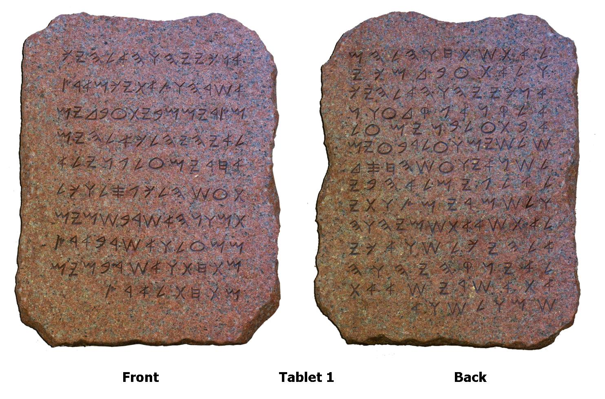

# WHAT DID MOSES (PBUH) TEACH THE JEWS [ACCORDING TO OLD TESTAMENT]?

**NOTE: The image does not show actual tablets of Moses (pbuh) because the original tablets have not been preserved**

### Who is Moses (pbuh)?
* Moses (pbuh) is considered to be a spritual teacher also known as a Prophet and a Messenger of All Mighty GOD who was sent to the Jews.
* When the Jews were suffering at the hands of Pharoah of Egypt, Moses (pbuh) received guidance from All Mighty GOD and followed GOD's commands and instructions which resulted in the rescue of the Jews from the tyranny of Pharoah.
* Soon after the rescue, Moses (pbuh) received revelation from All Mighty GOD on mountain Sina. This revelation is the Torat which is believed by the Jews to be the ten commandments.
* Moses (pbuh) ruled his nation by strictly applying the teachings of Torat.

### The Ten Commandments
1. > I am the LORD thy GOD
2. > Thou shalt have no other gods before ME
3. > Thou shalt not make unto thee any graven image
4. > Thou shalt not take the name of the LORD thy GOD in vain
5. > Remember the sabbath day, to keep it holy
6. > Honour thy father and thy mother
7. > Thou shalt not kill
8. > Thou shalt not commit adultery
9. > Thou shalt not steal
10. > Thou shalt not bear false witness against thy neighbour
11. > Thou shalt not cevet [neighbor's house]
12. > Thou shalt not covet [neighbor's wife]
13. > Thou shalt not covet [neighbor's servents, animals, or anything else]

	* [Bible - King James Version, Exodus Chapter 20, Verses 1 to 17]
	* [Bible - King James Version, Deuteronomy Chapter 5, Verses 4 to 21]
	
### Conclusion
* In conclusion, Moses (pbuh) believed in One GOD and taught people the same. Moses (pbuh) also ruled by the law of All Mighty GOD and expected his nation to abide by it.