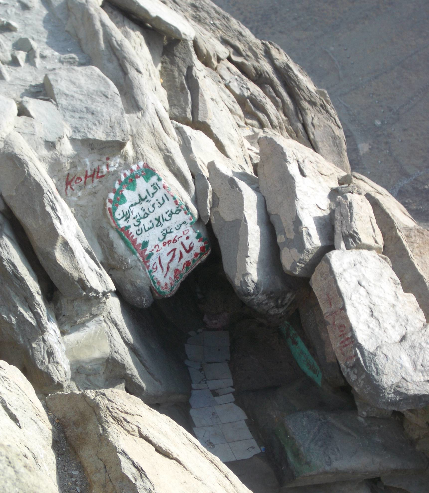

# WHAT DID MUHAMMAD (PBUH) TEACH ABOUT GOD?

 Fig: The cave in which Muhammad (pbuh) received his (pbuh) first revelation from arch angel Gabriel (*Jibrael* (*as*) in *Arabic*)

### Who is Muhammad (pbuh)?
* *Muhammad* (pbuh) was born in *Macca*, *Arabia* (Now Sa'udi Arabia) at round 570 CE. His full name is *Abu Al-Qasim Muhammad ibn 'Abd Allah ibn 'Abd al-Muttalib ibn Haashim* (... *Muhammad* the son of *Abd Allah*, the grand son of *Abd al-Muttalib*).
* He (pbuh) is a direct discendent of Prophet Abraham (pbuh) (*Ibraahim* (*as*) in *Arabic*) who is also the ansestor of Jesus (pbuh) (*'Isa* (*as*) in *Arabic*). This makes *Muhammad* (pbuh) and Jesus (pbuh) distant cousins.
* *Muhammad* (pbuh)'s father died even before his birth and his mother passed away when he (pbuh) was six. He (pbuh) was then raised by his (pbuh) paternal uncle *Abu Talib*.
* *Muhammad* (pbuh) grew up to become a merchant. He (pbuh) was known among his (pbuh) people as the honest and trust worthy (*assadiq al ameen* in *Arabic*). Occasionally he (pbuh) would retreat to a cave in a mountain.
* At the age of 40 when he (pbuh) was in the cave a miracle took place that changed his (pbuh) life. He was visited by arch angel Gabiel (pbuh) (*Jibrael* (*as*) in *Arabic*) and revealed to him (pbuh) a few verses in Arabic.
	1. > [Aududbillahi minashaitan irrajim, bismillah irrahman irrahim] **"Iqra, Bismirabbikalladhi Khalaq. Khalakal insaanamin alaq. Iqra wa RABBukal akram. Alladi allamabil qalam. Allamal insaanamaalam ya'lam"** (Read! in the name of thy LORD who created! Created man, out of a clot of congealed blood. Read! And thy LORD is most bountiful. Who taught (the use of) the pen, Taught man that which he knew not! [Qur'an Al-Alaq 96:1-5]
* From that day onwards, he (pbuh) continued to receive revelation from arch angel Gabriel (pbuh) in small chunks as and when it became necessary to deal with a problem or a situation that he (pbuh) encountered. He (pbuh) recieved revelation for a period of 23 years. These verses were then compiled into what we now know as the Qur'an. [Biography of the Prophet (pbuh) - *Ibn Ishaaq*, *Ibn Hishaam*]

### What did Muhammad (pbuh) achieve?
* *Muhammad* (pbuh) united *Arabia* into a single religious polity under Islam. Islam means "submission to the will of All Mighty GOD". Arabs who were polytheists during pre-Islamic times became worshippers of one All Mighty GOD. 
* He (pbuh) is believed by Muslims to be the last and final Prophet and Messenger of All Mighty GOD sent to guide the whole of mankind till the day of judgement.
* He (pbuh) influences the hearts and minds of billions of people even to this day and is gaining more and more followers from among different ratial and ethnic groups all over the world. He (pbuh) said the following in his last sermon
	1. > "... All mankind is from Adam and Eve, an Arab has no superiority over a non-Arab nor a non-Arab has any superiority over an Arab; also a white has no superiority over a black nor a black has any superiority over white except by piety and good action. ..."
* He (pbuh) also said the following about GOD in his (pbuh) last sermon
	1. >  "... O People, listen to me in earnest, worship GOD (The One Creator of the Universe) ..." 

### What did Muhammad (pbuh) teach about GOD?
* The basic tenet of Islam is, taking the following oath (*shahaadah* in *Arabic*)
	1. > **"ashhadu an la ilaha illa ALLAH wahdahu la sharikala, wa ashadu anna Muhammadan abduhu wa rasuluhu"** (I bear witness that there is none worthy of worship except All Mighty GOD and HE has no partners and I bear witness that Muhammad is HIS slave and messenger)
	
	2. **Etymology:** *ALLAH*: *Al* (The) + *ilah* (GOD) => The GOD => All Mighty GOD.
	3. **Meaning:** I take the oath that there is nothing/nobody worthy of worship and devotion but All Mighty GOD and HE has no partners who can claim divinity and I take the oath that Muhammad is his slave and messenger who has come to obediently follow and preach HIS message.
	
* The concept of GOD is concisely defined in a single chapter in the *Qur'an*

	1. > **"Audu billahi minashaitan irrajim, bismillah irrahman irrahim. qul huwALLAHu ahad. ALLAHu assamad. lam yalid, walam yuulad. walam yakunlahu kufuwan ahad."** (I seek refuge in All Mighty GOD from the cursed satan. In the name of All Mighty GOD, the most gracious, the most merciful. Say! He is ALLAH, The One and Only. ALLAH, the absolute, the eternal. HE begets not, nor is HE begotten. And there is none like unto HIM) [al-Qur'an 112:1-4]
	
	2. **Meaning:** Say! All Mighty GOD is one and only, All Mighty GOD is absolute and eternal. HE is neither the mother or father of anybody nor any body gives or has given birth to HIM. There is nothing that can be compared to HIM in this universe.
	3. **Commentary:** The attribute of being absolute and eternal can only belong to All Mighty GOD. All of HIS creation is temporary or conditional (dependent on HIM). The four line definition serves as a touchstone of theology (study of GOD) for Muslims. If anybody claims that he/she is GOD(dess), then the four verses are applied as test which none of HIS creation can pass (Because the last verse says "There is nothing like unto HIM").
	
* The following verses in the Qur'an explain the nature of All Mighty GOD
	1. > **"la tudrikuhu alabsaru wahuwa yudriku alabsara wahuwa allateefu alkhabeeru"** (No vision can grasp HIM, But HIS grasp is over all vision; HE is above all comprehension, Yet is acquainted with all things.) [al-Qur'an 6:103]
	2. > **"inna ALLAHa la yathlimu mithqala tharratin wain taku hasanatan yudaAAifha wayuti min ladunhu ajran AAatheeman"** (All Mighty GOD is never unjust in the least degreee; and if there is a good deed, HE will double it and will give (the doer) from HIS presence an immense reward) [Al-Qur'an 4:40]

#### What would happen if there were more than one GOD?
* The following verses explain why one should believe in and worship only One GOD.
	1. > **"law kana feehima alihatun illa ALLAHu lafasadata fasubhana ALLAHi rabbi alAAarshi AAamma yasifoona"** (If there were, in the heavens and the earth, other gods besides All Mighty GOD, there would have been confusion in both! But glory to All Mighty GOD, The LORD of the throne: (High is HE) above what they attribute to HIM!) [Al-Qur'an 21:22]

		1. **Commentary:** If there were more than one GOD, there would have been confusion in both heavens and the earth.
	
	3. > **"ma ittakhatha ALLAHu min waladin wama kana maAAahu min ilahin ithan lathahaba kullu ilahin bima khalaqa walaAAala baAAduhum AAala baAAdin subhana ALLAHi AAamma yasifoona"** (No son did All Mighty GOD beget, Nor is there any god along with HIM; (if there were many gods), behold, each god would have taken away what he had created, and some would have lorded it over others! Glory to All Mighty GOD (HE is free) from the (sort of) things they attribute to HIM!) [al-Qur'an 23:91]
		
		1. **Commentary:** If there were more than one GOD, they would have taken away their created and would have caused disharmony. However, everything is in perfect harmony because everything is created and sustained by one supreme GOD.

* The Author of the Qur'an often asks questions so that the readers may ponder deeply about them.
	1. > **"qul man yarzuqukum mina alssamai waalardi amman yamliku alssamAAa waalabsara waman yukhriju alhayya mina almayyiti wayukhriju almayyita mina alhayyi waman yudabbiru alamra fasayaqooloona ALLAHu faqul afala tattaqoona"** (Say: 'Who is it that sustains you (in life) from the sky and from the earth? Or who is it that has power over hearing and sight? And who is it that brings out the living from the dead and the dead from the living? and who is it that rules and regulates all affairs?' They will soon say, 'All Mighty GOD'. Say, 'Will you not then show piety (to HIM)?') [al-Qur'an 10:31]
	2. > **"walain saaltahum man khalaqahum layaqoolunna ALLAHu faanna yufakoona"** (If thou ask them, who created them, they will certainly say, 'All Mighty GOD': how then are they deluded away (from the truth)?) [al-Qur'an 43:87]

#### Islam condemns polytheism	
* During pre-Islamic times, the pagan Arabs (Maccans) knew that All Mighty GOD (ALLAH in Arabic) the most high was their CREATOR, SUSTAINER, LORD and MASTER. Yet they were considered as disbelievers becasue they worshipped other gods besided All Mighty GOD. All Mighty GOD classified such people as disbelievers (*Kuffar* in *Arabic*) and the ones who commit the gretest sin of associating partners with All Mighty GOD (*Mushrikeen* in *Arabic*)
	1. > **"wama yuminu aktharuhum biALLAHi illa wahum mushrikoona"** (And most of them believe not in All Mighty GOD without associating (others as partners) with HIM!) [al-Qur'an 12:106]

* Associating partners with All Mighty GOD is considered as the greatest sin in Islam according to the following verses
	1. > **"inna ALLAHu la yaghfiru an yushraka bihi wayaghfiru ma doona thalika liman yashao waman yushrik biALLAHi faqadi iftara ithman AAatheeman"** (All Mighty GOD forgives not that parners should be set up with HIM; but HE forgives anything else, to whom HE pleases; to set up partners with All Mighty GOD is to devise a sin most heinous indeed) [al-Qur'an 4:48]
	2. > **"laqad kafara allatheena qaloo inna ALLAHa huwa almaseehu ibnu maryama waqala almaseehu ya banee israeela oAAbudoo ALLAHa rabbee warabbakum innahu man yushrik biALLAHi faqad harrama ALLAHu AAalayhi aljannata wamawahu alnnaru wama lilththalimeena min ansarin"** (They do blaspheme who say: 'All Mighty GOD is Christ the son of Mary,' But said Christ: 'O children of Israel! Worship All Mighty GOD, my LORD and your LORD'. Whoever joins other gods with All Mighty GOD - All Mighty GOD will forbid him the garden, and the fire will be his abode. There will for the wrongdoers be no one to help.) [al-Qur'an 5:72]

* The Author of the Qur'an challenges all the people who associate partners with All Mighty GOD in the following verse and tells them how week those partners are as compared to All Mighty GOD.
	3. > **"ya ayyuha alnnasu duriba mathalun faistamiAAoo lahu inna allatheena tadAAoona min dooni ALLAHi lan yakhluqoo thubaban walawi ijtamaAAoo lahu wain yaslubuhumu alththubabu shayan la yastanqithoohu minhu daAAufa alttalibu waalmatloobu"** (O men! Here is a parable set forth! Listen to it! Those on whom, besides All Mighty GOD, you call, cannot create (even) a fly, if they all met together for the purpose! And if the fly should snatch away anything from them, they would have no power to release it from the fly. Feeble are those who petition and those whom they petition!) [al-Qur'an 22:73]
	
#### Relationship of Islam with other religions
* The Author of the Qur'an said the following addressing people who follow other religious faiths
	1. > **"Qul ya ahla alkitabi taAAalaw ila kalimatin sawain baynana wabaiyanakum alla naAAbuda illa ALLAHa wala nushrika bihi shayan wala yattakhitha baAAduna baAAdan arbaban min dooni ALLAHi fain tawallaw faqooloo ishhadoo bianna muslimoona"** (Say: 'O people of the book! Come to common terms as between us and you: That we worship none but All Mighty GOD; That we associate no partners with HIM; That we erect not, from among ourselves, lords and patrons other than All Mighty GOD.' If then they turn back, say ye: 'Bear witness that we (at least) are surrenderers to All Mighty GOD (*Muslims* in *Arabic*)) [al-Qur'an 3:64]

	1. **Etymology**: Muslim: Mu(The one) + Islam (Surrender to All Mighty GOD) => The surrenderers to All Mighty GOD
	2. **Commentary:** All Mighty GOD in the Qur'an invites people of all religeous faiths to atleast follow what is common between the followers of Muhammad (pbuh) and them. All the major religious scriptures teach that there is only One GOD and we must surrender to HIM alone and worship HIM alone but many of the adherents unfortunately do not follow the teachings of their own religious scriptures.
  
### Conclusion
* We can come to the conclusion that, Muhammad (pbuh) believed, followed and taught his disciples that there is only one GOD and HE alone should be worshipped without associating any partners with HIM nor believing that HE has a family tree. He (pbuh) also taught that HE is not like HIS creation and HIS creation is not like HIM. Furthermore, He (pbuh) taught and followed how to worship All Mighty GOD which has been documented in detail by his (pbuh) companions and passed on even to this day.